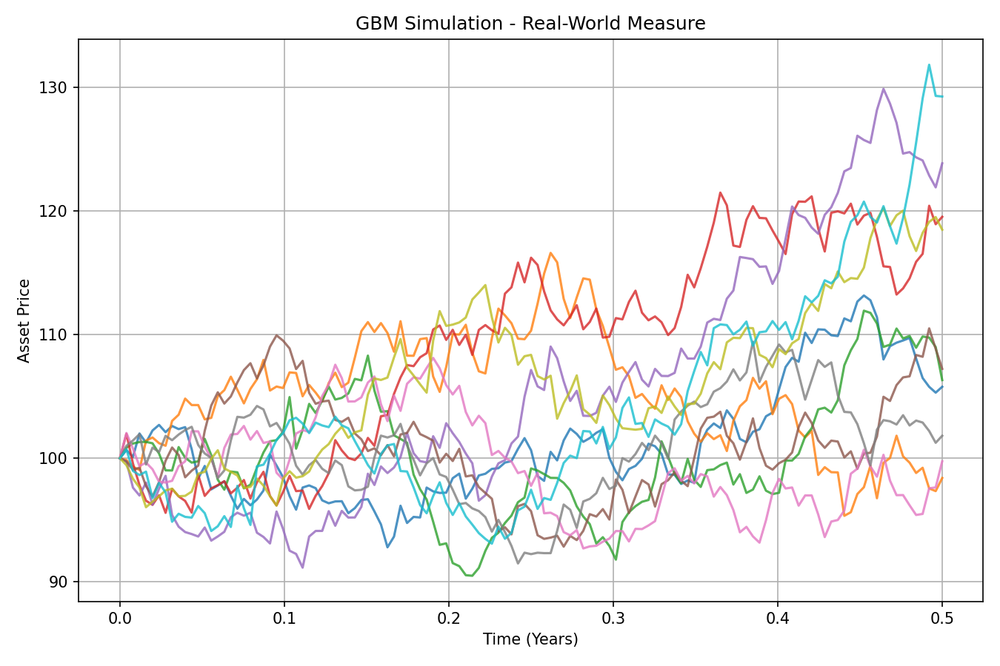
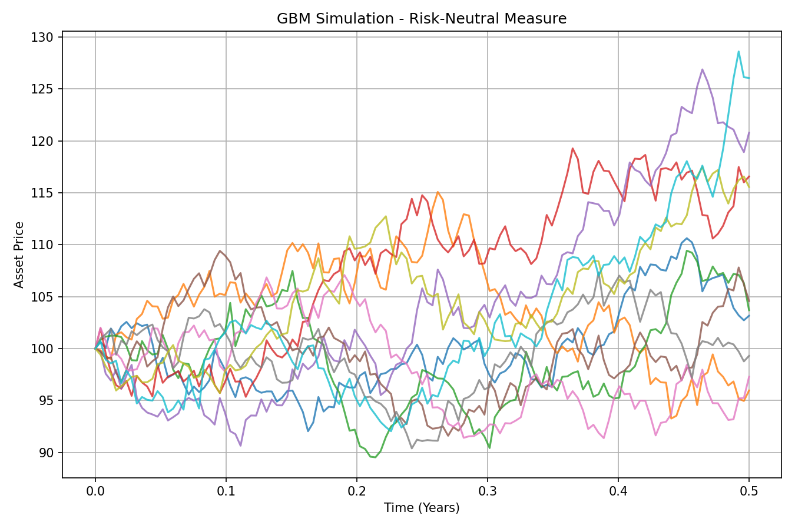
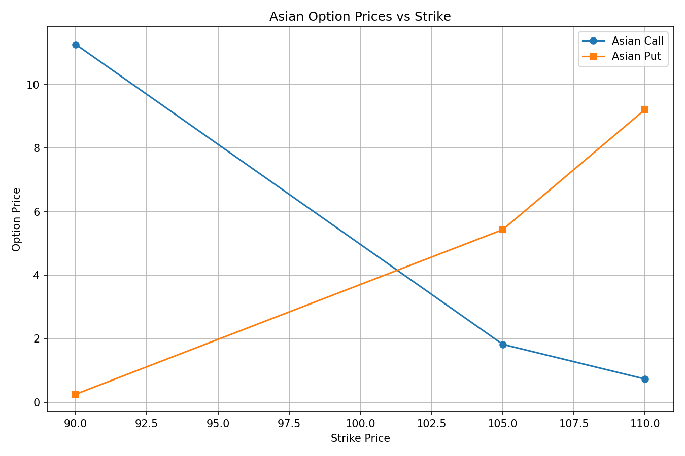
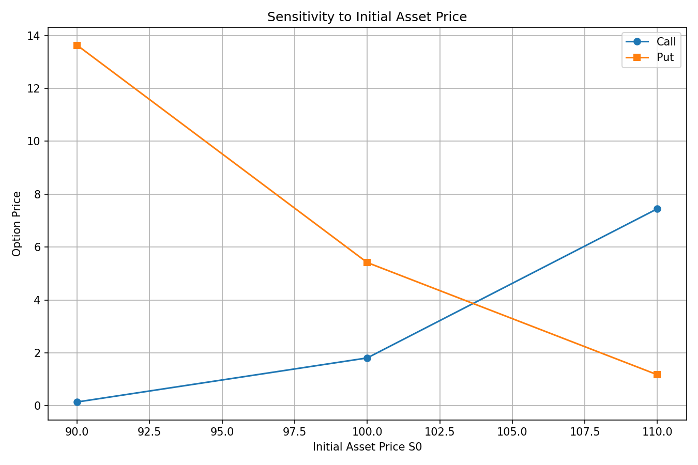
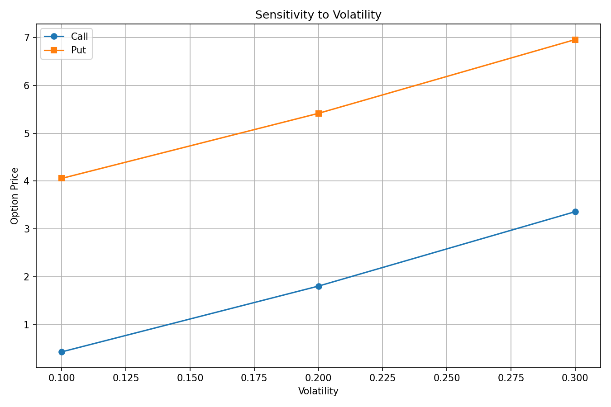
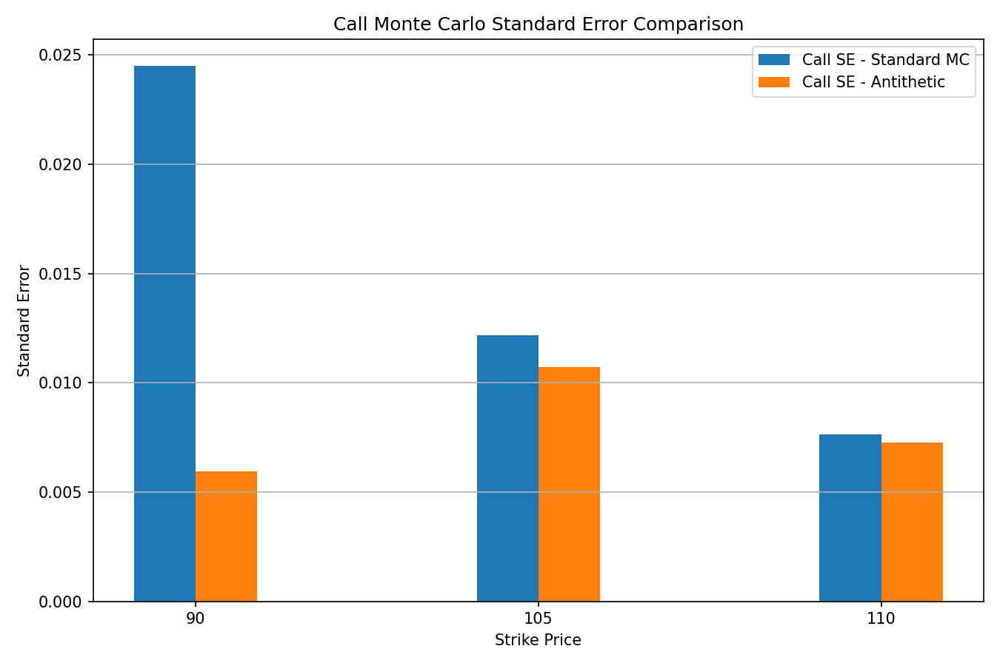
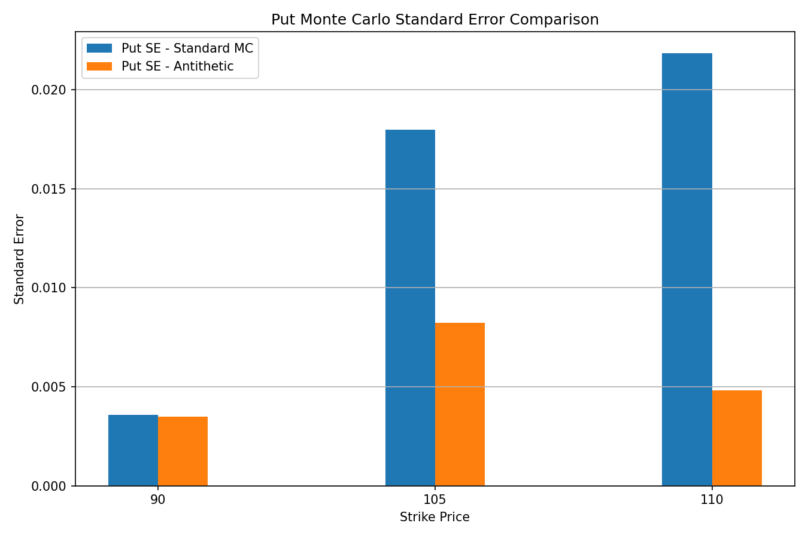

# 📈 Monte Carlo Asian Option Pricing

<p align="center">

<strong>Geometric Brownian Motion · Arithmetic Asian Options · Monte Carlo Simulation · Antithetic Variates</strong>

</p>

<p align="center">

A quantitative finance project implementing Monte Carlo pricing of arithmetic Asian call and put options under the risk-neutral measure, with GBM simulation, sensitivity analysis, confidence intervals, and variance reduction.

</p>

---

## 👤 Author

**Siba Sankar Mallick**  
B.Tech — Mathematics & Computing  
Indian Institute of Technology Guwahati

---

## 📌 Overview

This project implements a complete **Monte Carlo framework for pricing arithmetic Asian options** using Geometric Brownian Motion (GBM).

The analysis covers:

- GBM simulation under the real-world measure
- GBM simulation under the risk-neutral measure
- Simulation of 10 asset-price paths
- Arithmetic Asian call and put pricing
- Monte Carlo pricing for multiple strike prices
- Sensitivity analysis with respect to initial asset price
- Sensitivity analysis with respect to volatility
- Standard error estimation
- 95% confidence intervals
- Antithetic Variates for variance reduction
- Comparison between standard Monte Carlo and Antithetic Variates

The option maturity is **six months**, with **daily monitoring** of the underlying asset price.

---

## 🚀 Highlights

- Simulated GBM paths under both **real-world and risk-neutral measures**
- Used the risk-neutral drift **r = 5%** for option pricing
- Priced **arithmetic Asian call and put options**
- Evaluated strikes **K = 90, 105, 110**
- Used **100,000 Monte Carlo simulations**
- Computed Monte Carlo **standard errors and 95% confidence intervals**
- Performed sensitivity analysis for:
  - Initial asset price: **S₀ = 90, 100, 110**
  - Volatility: **σ = 10%, 20%, 30%**
- Implemented **Antithetic Variates**
- Quantified percentage **variance reduction**
- Compared standard Monte Carlo and variance-reduced estimates

---

## ⚙️ Model Parameters

| Parameter | Value |
|---|---:|
| Real-world drift, μ | 10% |
| Volatility, σ | 20% |
| Risk-free rate, r | 5% |
| Initial asset price, S₀ | 100 |
| Maturity, T | 0.5 years |
| Monitoring points, N | 126 |
| Visualization paths | 10 |
| Monte Carlo paths | 100,000 |
| Strike prices | 90, 105, 110 |
| Random seed | 42 |

The six-month horizon is represented using **126 daily monitoring points**.

---

## 🧮 Mathematical Framework

### Geometric Brownian Motion

The underlying asset follows:

$$
dS_t = \mu S_t\,dt + \sigma S_t\,dW_t
$$

where:

- $S_t$ = asset price at time $t$
- $\mu$ = drift
- $\sigma$ = volatility
- $W_t$ = standard Brownian motion

The exact GBM discretization used for simulation is:

$$
S_{t+\Delta t}=S_t\exp\left[\left(\mu-\frac{1}{2}\sigma^2\right)\Delta t + \sigma\sqrt {\Delta t} Z\right]
$$

where:

$$
Z\sim N(0,1)
$$

and:

$$
\Delta t = \frac{T}{N}
$$

---

## 🌍 Real-World and Risk-Neutral Measures

Under the **real-world measure**, the specified drift is:

$$
\mu = 10\%
$$

For risk-neutral option pricing, the drift is replaced by the risk-free rate:

$$
\mu \rightarrow r
$$

giving:

$$
S_{t+\Delta t} = S_t\exp\left[\left(r-\frac{1}{2}\sigma^2\right)\Delta t + \sigma\sqrt{\Delta t}Z \right]
$$

with:

$$
r = 5\%
$$

The same random shocks are used when generating the 10 real-world and risk-neutral visualization paths so that the comparison isolates the effect of the different drift rates.

---

## 🥇 Arithmetic Asian Options

For an arithmetic-average Asian option, the average underlying price is:

$$
\bar{S} = \frac{1}{N} \sum_{i=1}^{N}S_{t_i}
$$

The implementation uses the **126 simulated daily prices** and excludes the initial price $S_0$ from the averaging calculation.

### Asian Call Payoff

$$
C_T = \max(\bar{S}-K,0)
$$

### Asian Put Payoff

$$
P_T = \max(K-\bar{S},0)
$$

The corresponding risk-neutral prices are:

$$
C_0 = e^{-rT}\mathbb{E}^{\mathbb{Q}} \left[\max(\bar{S}-K,0)\right]
$$

and

$$
P_0 = e^{-rT}\mathbb{E}^{\mathbb{Q}} \left[ \max(K-\bar{S},0) \right]
$$

---

## 🎲 Monte Carlo Pricing

With $M$ simulated paths, the Asian call price is estimated as:

$$
\hat{C} = e^{-rT} \frac{1}{M} \sum_{j=1}^{M} \max(\bar{S}_j-K,0)
$$

Similarly, the Asian put price is:

$$
\hat{P} = e^{-rT} \frac{1}{M} \sum_{j=1}^{M}\max(K-\bar{S}_j,0)
$$

The project uses:

$$
M = 100,000
$$

Monte Carlo simulations.

---

## 📊 Standard Error & Confidence Intervals

For simulated payoffs $X_1,\ldots,X_M$, the standard error of the Monte Carlo estimator is:

$$
SE = e^{-rT}\frac{s_X}{\sqrt{M}}
$$

where $s_X$ is the sample standard deviation of the simulated payoff.

The approximate 95% confidence interval is:

$$
CI_{95\%} = \left[\hat{V}-1.96SE,\;\hat{V}+1.96SE\right]
$$

where $\hat{V}$ represents either the call or put price.

---

## 🎯 Strike Price Analysis

The Asian options are priced for:

$$
K\in\{90,105,110\}
$$

For fixed model parameters:

- Increasing $K$ generally decreases the Asian call value.
- Increasing $K$ generally increases the Asian put value.

The project compares the option prices across all three strike prices.

---

## 📉 Sensitivity Analysis

### Initial Asset Price

For:

$$
S_0\in\{90,100,110\}
$$

the Asian call and put prices are calculated using:

$$
K=105
$$

with fixed:

$$
r=5\%,\qquad \sigma=20\%,\qquad T=0.5
$$

An increase in $S_0$ generally:

- increases the call value
- decreases the put value

### Volatility

For:

$$
\sigma\in\{10\%,20\%,30\%\}
$$

the Asian call and put prices are calculated using:

$$
S_0=100,\qquad K=105
$$

with fixed:

$$
r=5\%,\qquad T=0.5
$$

Higher volatility generally increases the value of both call and put options because it increases the dispersion of the average asset price.

---

## 🔄 Antithetic Variates

For every simulated random vector:

$$
Z
$$

an antithetic vector is generated:

$$
-Z
$$

The paired call payoff estimator is:

$$
X_C^{AV} = \frac{1}{2}\left(X_C(Z)+X_C(-Z)\right)
$$

and the paired put payoff estimator is:

$$
X_P^{AV} = \frac{1}{2}\left(X_P(Z)+X_P(-Z)\right)
$$

The final estimator is:

$$
\hat{V}_{AV} = e^{-rT}\frac{1}{M/2}\sum_{j=1}^{M/2}X_j^{AV}
$$

where $M/2$ is the number of antithetic pairs.

---

## 📐 Variance Reduction

The percentage variance reduction is calculated as:

$$
\text{Variance Reduction} = \left(1-\frac{SE_{AV}^2}{SE_{MC}^2}\right)\times100
$$

where:

- $SE_{MC}$ = standard Monte Carlo standard error
- $SE_{AV}$ = Antithetic Variates standard error

A positive value indicates that the Antithetic Variates estimator has lower variance than the standard Monte Carlo estimator.

---

## 🔬 Standard Monte Carlo vs Antithetic Variates

For each strike price:

$$
K=90,\;105,\;110
$$

the project compares:

| Measure | Standard MC | Antithetic Variates |
|---|:---:|:---:|
| Call price | ✓ | ✓ |
| Put price | ✓ | ✓ |
| Call standard error | ✓ | ✓ |
| Put standard error | ✓ | ✓ |
| 95% confidence interval | ✓ | ✓ |
| Variance reduction | — | ✓ |

---

## 🔄 Analysis Workflow

```text
                    ┌──────────────────────┐
                    │    Model Parameters  │
                    │ μ, σ, r, S₀, T, N    │
                    └──────────┬───────────┘
                               │
                               ▼
                    ┌──────────────────────┐
                    │   GBM Simulation     │
                    └──────────┬───────────┘
                               │
                ┌──────────────┴──────────────┐
                ▼                             ▼
      ┌───────────────────┐         ┌───────────────────┐
      │ Real-World GBM    │         │ Risk-Neutral GBM │
      │ Drift = μ = 10%   │         │ Drift = r = 5%   │
      └─────────┬─────────┘         └─────────┬─────────┘
                │                             │
                │                             ▼
                │                  ┌────────────────────┐
                │                  │ Arithmetic Average │
                │                  └─────────┬──────────┘
                │                            │
                │                            ▼
                │                  ┌────────────────────┐
                │                  │ Asian Call & Put   │
                │                  │ Payoffs             │
                │                  └─────────┬──────────┘
                │                            │
                │                            ▼
                │                  ┌────────────────────┐
                │                  │ Monte Carlo Price  │
                │                  └─────────┬──────────┘
                │                            │
                │              ┌─────────────┴─────────────┐
                │              ▼                           ▼
                │      ┌─────────────────┐        ┌─────────────────┐
                │      │ Standard Error  │        │ 95% Confidence │
                │      │                 │        │ Interval        │
                │      └─────────────────┘        └─────────────────┘
                │
                └──────────────────────┐
                                       ▼
                            ┌────────────────────┐
                            │ Sensitivity        │
                            │ Analysis            │
                            └─────────┬──────────┘
                                      │
                         ┌────────────┴────────────┐
                         ▼                         ▼
                  ┌──────────────┐         ┌──────────────┐
                  │ Initial S₀   │         │ Volatility σ │
                  └──────────────┘         └──────────────┘

                            Risk-Neutral Paths
                                      │
                                      ▼
                            ┌────────────────────┐
                            │ Antithetic         │
                            │ Variates           │
                            └─────────┬──────────┘
                                      │
                                      ▼
                            ┌────────────────────┐
                            │ MC vs AV           │
                            │ Variance Reduction │
                            └────────────────────┘
```

---

## 🖼️ Visualizations

### GBM Simulation

<table>
<tr>
<td align="center">

<strong>Real-World GBM Paths</strong><br><br>



</td>

<td align="center">

<strong>Risk-Neutral GBM Paths</strong><br><br>



</td>
</tr>
</table>

---

### Asian Option Pricing

<p align="center">

<strong>Asian Option Prices vs Strike</strong><br><br>



</p>

---

### Sensitivity Analysis

<table>
<tr>
<td align="center">

<strong>Sensitivity to Initial Asset Price</strong><br><br>



</td>

<td align="center">

<strong>Sensitivity to Volatility</strong><br><br>



</td>
</tr>
</table>

---

### Variance Reduction

<table>
<tr>
<td align="center">

<strong>Call Standard Error Comparison</strong><br><br>



</td>

<td align="center">

<strong>Put Standard Error Comparison</strong><br><br>



</td>
</tr>
</table>

---

## 💾 Outputs

The generated numerical results are stored in the `outputs/` directory.

The output tables contain:

- Standard Monte Carlo Asian option prices
- Standard errors
- 95% confidence intervals
- Sensitivity analysis results
- Standard Monte Carlo vs Antithetic Variates comparison
- Variance-reduction statistics

All numerical outputs are stored as structured CSV tables for further analysis.

---

## 📁 Repository Structure

```text
Monte-Carlo-Asian-Option-Pricing/

│
├── asian_option_pricing.py
│
├── outputs/
│   ├── asian_option_mc_results.csv
│   ├── sensitivity_analysis.csv
│   └── mc_vs_antithetic_comparison.csv
│
├── results/
│   ├── 01_gbm_real_world.png
│   ├── 02_gbm_risk_neutral.png
│   ├── 03_option_prices_vs_strike.png
│   ├── 04_sensitivity_S0.png
│   ├── 05_sensitivity_volatility.png
│   ├── 06_call_standard_error_comparison.png
│   └── 07_put_standard_error_comparison.png
│
├── requirements.txt
│
└── README.md
```

---

## 🛠️ Tech Stack

| Technology | Purpose |
|---|---|
| **Python** | Core implementation |
| **NumPy** | GBM simulation and numerical computation |
| **Pandas** | Result processing and structured output |
| **Matplotlib** | Financial visualization |

---

## ▶️ Installation

Clone the repository:

```bash
git clone <your-repository-url>
cd Monte-Carlo-Asian-Option-Pricing
```

Install the required dependencies:

```bash
pip install -r requirements.txt
```

---

## ▶️ Running the Analysis

Run the complete pricing and analysis:

```bash
python asian_option_pricing.py
```

The program:

1. Defines the GBM model parameters
2. Simulates real-world GBM paths
3. Simulates risk-neutral GBM paths
4. Generates the GBM visualizations
5. Prices arithmetic Asian call and put options
6. Evaluates strikes 90, 105, and 110
7. Computes standard errors
8. Computes 95% confidence intervals
9. Performs initial-price sensitivity analysis
10. Performs volatility sensitivity analysis
11. Applies Antithetic Variates
12. Compares standard MC and Antithetic estimates
13. Calculates variance reduction
14. Saves analysis plots to `results/`
15. Saves numerical result tables to `outputs/`

---

## 🧠 Quantitative Finance Concepts

This project demonstrates practical implementation of:

- Geometric Brownian Motion
- Risk-Neutral Pricing
- Real-World vs Risk-Neutral Measures
- Arithmetic Asian Options
- Monte Carlo Simulation
- Option Payoff Modeling
- Standard Error Estimation
- Confidence Intervals
- Sensitivity Analysis
- Variance Reduction
- Antithetic Variates
- Numerical Methods in Quantitative Finance

---

## 📌 Key Takeaways

The implementation demonstrates how Monte Carlo simulation can be used to price path-dependent Asian options whose payoff depends on the arithmetic average of the underlying asset price.

The analysis also demonstrates:

- The effect of replacing the real-world drift with the risk-free rate for risk-neutral pricing.
- The relationship between strike price and Asian call/put values.
- The sensitivity of option prices to the initial asset price and volatility.
- The statistical uncertainty associated with Monte Carlo estimates through standard errors and confidence intervals.
- The use of Antithetic Variates to improve Monte Carlo efficiency by reducing estimator variance.

---

<p align="center">

<strong>Siba Sankar Mallick</strong><br>
B.Tech — Mathematics & Computing<br>
Indian Institute of Technology Guwahati

</p>
